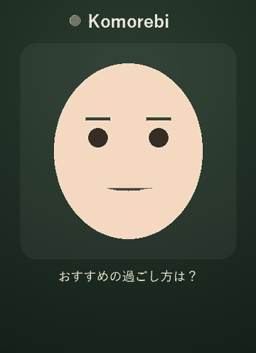

# 🌿 Komorebi

> Make AI approachable. An open-source AITuber engine that lets anyone talk to a
> living animated character — no setup, no fear, no API key required to try.

[](./LICENSE)


<!-- demo.gif is rendered offline from the *real* echo reply + heuristic emotion +
     placeholder-avatar geometry: `python scripts/generate_demo_gif.py`. -->
<p align="center">
  
  <br /><em>1:1 chat, then live-stream mode — both with zero API keys (<a href="#quick-start-demo-mode-no-api-key">Quick start</a>).</em>
</p>

## Why Komorebi?

Most people don't reject AI because it's not smart enough — they reject it because
a blinking text box feels cold and intimidating. **Komorebi's thesis: an animated
character lowers the psychological barrier to AI.** A face that smiles, thinks, and
reacts turns "using a tool" into "talking to someone."

Komorebi is built around **Acceptance UX** as a first-class concept, not an
afterthought.

### What makes it different

- **Avatar-agnostic core.** One emotion/lip-sync API drives any renderer — VRM (3D),
  Live2D (2D anime), or a dependency-free placeholder. Swap your favorite model in.
- **Provider-agnostic brain.** The "brain" speaks to OpenAI / Codex / Claude / local
  Ollama through one `LLMBackend` interface.
- **Persona Packs.** A character's personality, voice, and expression mapping live in
  a single shareable file. Add a character with one pull request.
- **Try in 30 seconds.** A built-in demo mode runs with zero API keys.

## Architecture (one glance)

```
Browser (thin TS: rendering only)        Python Core (FastAPI + asyncio)
  AvatarRenderer  ◄── WebSocket ──►  Orchestrator
   VRM / Live2D / Placeholder          ├─ LLMBackend   (openai / codex / ollama / echo)
                                       ├─ EmotionEngine (text → expression command)
                                       ├─ TTSBackend   (voicevox / style-bert-vits2 / silent)
                                       └─ PersonaLoader (persona packs)
```

The browser only draws. The Python core does all the thinking and streams back
subtitles, expression events, and visemes over a single WebSocket. The WebSocket
message schema is the frozen contract between the two layers — see
[`docs/architecture.md`](./docs/architecture.md).

## Quick start (demo mode, no API key)

```bash
# 1. backend
cd core
pip install -e .
python -m komorebi            # serves ws + static web on http://localhost:8000

# 2. open the browser
#    visit http://localhost:8000 and start typing
```

Demo mode uses the `echo` LLM backend and a silent TTS backend, so the character
reacts and lip-syncs without any external service. Plug in a real backend via env
vars (see [`docs/architecture.md`](./docs/architecture.md)) when you're ready.

Want the **AITuber / live-stream view** instead? Same zero setup:

```bash
KOMOREBI_STREAM=mock python -m komorebi
# then open http://localhost:8000/?mode=live
```

A shared character reacts to a built-in mock chat feed — swap `mock` for `twitch`
(no credentials) or `youtube` to drive it from a real stream. See
[`docs/live-streaming.md`](./docs/live-streaming.md).

## Roadmap

- **M0 — skeleton ✅:** monorepo, WebSocket contract, demo loop, placeholder avatar.
- **M1 — Acceptance UX ✅:** 30-second guided onboarding with a persona picker,
  EmotionEngine v1 (pluggable heuristic / LLM classifier, per-sentence timed
  expressions), Persona Pack spec + 3 sample characters.
- **M2 — dual avatars ◐:** `AvatarBackend` abstraction with a real 3D **VRM
  renderer** (three-vrm) alongside the placeholder, selectable at runtime and
  falling back gracefully. Live2D (optional plugin) and the TS + Vite migration are
  the remaining M2 items. See [`docs/avatar-renderers.md`](./docs/avatar-renderers.md).
- **M3 — real demand (you are here) ✅:** live broadcast mode driven by real
  Twitch / YouTube chat (plus a zero-setup `mock` source), a community persona
  gallery, and a first-class **Codex** LLM backend. See
  [`docs/live-streaming.md`](./docs/live-streaming.md).

### Live broadcast mode (AITuber on a stream)

The same engine that powers 1:1 chat can run a *shared* character that reacts to
a live chat feed and broadcasts to every viewer — point OBS at it and you have an
AITuber. It runs out of the box with a built-in mock chat source:

```bash
KOMOREBI_STREAM=mock python -m komorebi
# open http://localhost:8000/?mode=live
```

Twitch works with **no credentials** (anonymous read-only IRC); YouTube needs an
API key. Full setup in [`docs/live-streaming.md`](./docs/live-streaming.md).

### Powered by Codex

Komorebi ships a first-class `codex` LLM backend — "powered by Codex" is one line
of config:

```bash
KOMOREBI_LLM=codex OPENAI_API_KEY=sk-... python -m komorebi
```

With no key set the character explains how to enable it instead of failing, so
the zero-config demo (`KOMOREBI_LLM=echo`) stays the friendly default.

### Choosing the emotion engine

Set `KOMOREBI_EMOTION=heuristic` (default, zero-cost keyword rules) or
`KOMOREBI_EMOTION=llm` (labels each line with the configured LLM backend, falling
back to the heuristic on any error).

### Add a persona (no code)

Drop a YAML file in [`personas/community/`](./personas/community/) and it shows up
in the picker automatically — see the gallery README there for the 3-step flow.

## Contributing

Adding a persona, a backend, or an avatar renderer is the easiest way in — see
[`CONTRIBUTING.md`](./CONTRIBUTING.md). Look for `good first issue`.

## License

MIT. Note: the optional Live2D renderer (planned) depends on the Live2D Cubism
SDK, which has its own commercial license and is therefore shipped as a
**separate optional plugin** to keep the core 100% MIT.
